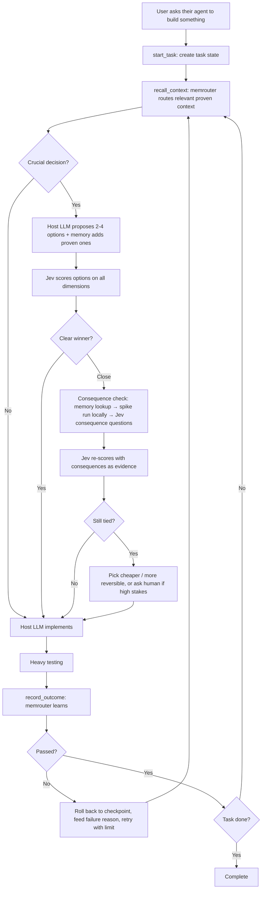

# Long-Horizon Agent Platform — Master Project Document

> **This is the source of truth.** It consolidates every decision made so far.
> - `MEMROUTER.md` holds the detailed memory spec and remains valid; where it conflicts with this file, **this file wins**.
>
> Status: design complete for the core; several component specs still to write (see §15).

---

## 1. Problem

Agents on long, multi-step tasks fail in predictable ways:
- **Context bloat** → high token cost, worse reasoning.
- **Goal drift** → lose goal, constraints, earlier decisions.
- **Wrong early choices** → a crucial decision (framework, database, architecture) made in one shot, discovered wrong many steps later.
- **Compounding errors** with no clean recovery.
- **No learning** → every task starts from zero; the same mistakes repeat.
- **Low visibility** into why the agent did what it did.

Simple tools already solve narrow checks (e.g. `tsc`, ESLint). The platform exists only for problems simple tools can't solve: choosing well between valid options, staying on track, recovering cleanly, controlling cost, and learning over time.

## 2. What makes us different

Frontier coding agents (Claude Code, Codex, etc.) already have checkpoints, context compaction, project memory files and sandboxed tests. Shared cross-tool memory also exists (e.g. Iranti, ai-memory, mem0, Zep). **We don't compete on those.**

Our edge:
1. **Decision layer** — crucial choices are scored by a fast System One model (Jev) across cost, latency, tokens, compatibility, architecture and more, before committing.
2. **Consequence checking on close calls** — simulate before choosing, then re-score with evidence.
3. **Outcome-learning memory (memrouter)** — remembers *what worked* under which conditions, not just what happened. Gets better with every task.

Pitch: *"Other tools give agents a better notebook. We give them experience."* / *"Memory that learns like a brain, engineered like a database."*

## 3. Product model

- Users **install our MCP server** and connect it to their existing agent: Claude Code, Codex, Cursor, others.
- Access requires a **platform API key**.
- Calls consume **credits**, which pay for: Jev scoring, simulations orchestration, memrouter storage/routing, context building.
- **The user's own LLM session does the generation and implementation** (their CLI/UI and subscription). We never run the working LLM.
- Economics: expensive LLM tokens are paid by the user's existing subscription; our costs are cheap components → good margins, low price.
- Free starter tier for adoption. Show **savings per session** (tokens saved, decisions made, failures avoided) so credits feel worth it.

Division of labour:
- **Host LLM:** proposes options, implements, runs tests and spikes locally.
- **Our platform:** decides, remembers, learns, routes context.

## 4. End-to-end flow

## 5. Decision layer (Jev)

- **Jev** = System One model by TypeSafe AI. Takes state + typed questions, returns typed answers with confidence. Non-generative, fast, cheap. Early access (launched Sept 2026) → verify on our own tasks; keep swappable.
- **Only crucial decisions** go through the full flow: hard to reverse, affects many later steps, or has real cost (framework, DB, architecture, key libraries). Routine steps skip it.
- **Scoring dimensions:** budget/cost, latency, token usage, compatibility, architecture fit, accuracy, and others as needed.
- **One question per dimension per option**, run in parallel; combine in our code with configurable weights.
- **Compute what's measurable in code** (token and cost estimates); use Jev for judgements (compatibility, architecture fit, accuracy).
- **Two passes:** Jev scores options → on close calls, consequences are gathered → Jev re-scores with them as evidence. The simulation informs; Jev decides.
- **Second tie:** don't loop. Pick the cheaper or more reversible option, or ask a human if stakes are high.
- Memory feeds Jev evidence (track records, fear warnings) before scoring.
- Keep a small-LLM scorer as comparison to prove Jev's value.

**As built** (`src/horizon/decision/`, the `evaluate_options` tool):
- **One Jev request per decision.** Crucial = any of *hard to reverse*, *shapes many later steps* or *real cost* at ≥ 0.5. High stakes = *real-world harm that is hard to undo* (money, messages to people, destroying user or production data) at ≥ 0.5, or a matching fear lesson.
- **Per option:** success (a Noul, which is also the recorded prediction), compatibility and architecture fit (5-level Scores), and reversibility. Cost, tokens and latency come from the host's estimates, relative to the cheapest option.
- **Weights:** success 0.30, compatibility 0.20, architecture fit 0.20, cost 0.15, tokens 0.10, latency 0.05; in the second pass also no_regressions 0.20 and relative_cost 0.10. They're renormalised over the dimensions available.
- **Clear winner** = a lead ≥ 0.10 with the leader's Score confidence ≥ 0.5. After evidence, a lead ≥ 0.20 stands even with low confidence.
- **Scorer bias:** once a scorer has 20+ outcomes, its measured bias is subtracted from its success estimates (`MEMROUTER.md` §5 step 4).
- **The comparison scorer:** `HORIZON_SCORER=llm` (Claude Haiku) sits behind the same interface. `horizon compare-scorers` replays logged decisions through both scorers and reports agreement and Brier scores against outcomes.
- **The final decision** is one of `routine`, `clear_winner`, `check_consequences`, `try_and_rollback`, `close_call`, `ask_human` (the user picks through an MCP user-input request, which becomes `human_choice`) or `unscored`.

## 6. Consequence checking ("world model")

Generative world model is too expensive and we don't want generated text — only consequences. Chain, cheapest first:

1. **Static checks** (type checks, lint, dry runs, affected tests) — real consequences, no tokens.
2. **Memory lookup** — similar past decisions and their outcomes; reuse past spike results.
3. **Spike** — tiny proof of concept per close option, **run on the user's machine by the host LLM**; our MCP specifies what to build and measure. Returns **structured results** (numbers, pass/fail), not prose.
4. **Jev consequence questions** — "will this break existing tests?", "will it exceed token budget?".
5. **Try and roll back** — sometimes cheaper than simulating.

**Learned world model (later):** DreamerV3-style latent world model trained on our logged state → option → outcome data. Predicts success, tokens, cost in latent space in milliseconds. Kept in the architecture from day one behind the same interface; swapped in only when it beats the stand-ins. **Log data in a trainable format from day one.**

Open experiment: on a sample of ties, run all options for real, then compare Jev vs simulation accuracy and cost. Also a strong publishable result.

**As built** (`submit_consequences`):
- **The chain for a close call:**
  1. past spike results from memory (settled from memory if every close option was tested before);
  2. try-and-rollback when every close option has reversibility ≥ 0.7, a git checkpoint exists and the stakes aren't high;
  3. otherwise a plan of static checks, then one spike per option.
- **A plan spike** is `{option, build, measure[], budget_minutes}`, built under the git-ignored `.horizon/spikes/`.
- **A submitted result** is `{option, static_checks[{name, passed}], spike{ran, passed, tests_passed, tests_failed, metrics{name: number}, duration_s}, notes}`.
- **The second pass** re-asks the per-option questions with `consequences` in the state, plus *breaks existing tests?* and *costlier?*. A failed check eliminates an option; spike metrics replace estimates; a second tie doesn't loop.
- **World-model log format:** one versioned record per decision (`horizon.decision` v1). It holds the state, every raw scorer answer from both passes, the consequences, the final decision and the outcomes; `horizon export-decisions` writes JSONL. Episodes are exported to Parquet by the sleep job.
- **The world-model interface and a first learned model** (`src/horizon/decision/worldmodel.py`):
  - `WorldModel.predict(situation, conditions, options)` returns each option's success, tokens, cost and latency, with a confidence. `HORIZON_WORLD_MODEL_CLASS` swaps in another implementation, such as a Dreamer-style model trained on the exports.
  - The first model, `kernel-v1`, is a similarity-weighted estimate over every episode about the same option, archived ones included, shrunk towards the team's base rate. It learns online, from an in-memory index that updates incrementally (a removal or purge reloads it), and answers in milliseconds.
  - **"Swapped in only when it beats the stand-ins":** a replay predicts each past episode from strictly earlier ones. The model must be clearly better (a one-sided paired test at 95 %) than every stand-in (Jev, the small LLM, the host) with 30+ paired outcomes (`horizon eval-world-model`).
  - Until then (`HORIZON_WORLD_MODEL=auto`), forecasts are only logged with each decision. Once active, they fill missing estimates and settle a close call when every untested option is confidently forecast. That step comes after memory and before try-and-rollback, and Jev still re-scores with the forecasts as evidence. Its accuracy is tracked as predictor source `world_model`.
  - **Efficiency targets:** the PreToolUse hook sums an attempt's real token usage and time from the host's transcript before `record_outcome`, so outcomes carry actual tokens and latency.

## 7. Memrouter

Full spec in `MEMROUTER.md`. Summary of decisions:
- **Memory types:** episodes (decision records) → consolidated into lessons and strategies by a periodic **"sleep" job**.
- **Episodes are never deleted.** The sleep job archives low-value episodes to cold storage: excluded from retrieval, kept as world-model training data. Pruning applies only to links and the retrieval index.
- **Link learning:** Hebbian, driven by **surprise** = signed prediction error (zero-centred: success error and efficiency errors against their predictions, range −1 to 1; formula in `MEMROUTER.md` §5), weighted human > auto > implicit.
- **Routing:** similarity + condition match → **spreading activation** through links → Jev as **attention filter** within a token budget.
- **Decay:** usage-based with **spaced repetition**; pruning of weak links; nothing permanent.
- **Conditions + reconsolidation:** outcomes carry conditions (stack, scale…); contradictions refine conditions instead of just weakening.
- **Fear memories:** one severe failure creates a strong warning instantly, still revisable.
- **Scope:** task → project → team, fully isolated per team. Later, opt-in **colony layer** sharing only anonymous trail strengths.
- **Shared context layer** for all agents, subagents and sessions, with provenance and conflict handling.
- **Tracks predictor trust** (was Jev / simulation / memory right?).
- **Not a single point of failure:** agents keep working on task state if memrouter is down.
- Storage: Postgres + pgvector to start.

## 8. Task state and checkpoints

- **Task state** (created by `start_task`, stored by us): goal (verbatim), constraints, plan, progress, key decisions and reasons, open issues. Compact, always included in routed context.
- **Checkpoints** use the host's own mechanisms (git commits, Claude Code checkpoints); we record checkpoint references with each decision.
- **Rollback:** restore, feed the failure reason back into the decision step, enforce retry limit, escalate to human after the limit.

**As built:**
- **Checkpoints:** before each `recall_context`, a hook records a git snapshot (`git stash create` or HEAD; nothing changes in the repo) and, in Claude Code, the `/rewind` prompt. Hosts without hooks can pass `checkpoint_commit`.
- **Rollback:** a regression (§9) returns `rollback` with the restore command, always to the checkpoint from before the first failure in the streak. The failure reasons are fed back in `task_state.retry`, and the recall hook refuses one recall if the tree wasn't restored.
- **Limits:** after 3 consecutive failed attempts (`HORIZON_MAX_ATTEMPTS`), **or at once for a severe outcome**, the task is escalated. The user is asked through an MCP user-input request, and their answer resumes the task.

## 9. Outcome and testing layer

- **Heavy testing after every implementation** is the ground truth.
- **Judge against a baseline, not the absolute pass rate.** The tests already failing when the task starts are recorded as its baseline. Outcomes are judged on regressions (new failures) and on the task's target tests. Success is the pass rate with baseline failures excluded (target tests always count). A rollback is triggered only by regressions, and pre-existing failures are reported separately.
- Signals, cheapest first: **automatic** (tests, builds, type/lint checks) → **implicit** (user accepts / edits / reverts) → **human approval** only when others are missing, confidence is low, or stakes are high (spending money, sending messages, deleting data).
- Outcomes are **self-reported by the host** → risk of skipping or misreporting. Use **hooks** to capture real test output instead of trusting the model's summary.
- Record: option chosen, what Jev and simulation predicted, what tests found.
- **As built:**
  - "Heavy testing" = the host's own test suite. It runs once before any change (the baseline) and after every change.
  - The PostToolUse hook captures counts and failing test ids, never output, and they override the host's report.
  - Implicit signals aren't captured automatically: the host can pass `signal_type: "implicit"` (for example when the user reverts a change).

## 10. User interface

- **No full dashboard in v1.** The "better view" lives inside the user's agent conversation.
- **Human approvals** via MCP's ability to request user input mid-task.
- **Inspection MCP tools:** explain a decision, show relevant memories, view and delete memories.
- **Minimal web page:** account, API keys, credits, usage, savings.
- **Internal debugging/benchmarks:** existing tracing tool (e.g. Langfuse).
- **Full dashboard later** when teams running many agents ask for a shared view (signal for a paid team tier).

## 11. LLM integration (MCP)

**Core tools:**
- `start_task` — create task state.
- `recall_context` — return routed memory slice + task state.
- `evaluate_options` — take candidates, return decision or a spike request.
- `submit_consequences` — spike / check results → Jev re-score.
- `record_outcome` — test results and signals → memory learning.

**Inspection tools:** `explain_decision`, `show_memories`, `delete_memory`, `clear_fear`.

**Getting called reliably (biggest product risk):** MCP is passive; the host decides when to call. Ship with:
- Clear, directive tool descriptions.
- Ready-made instruction snippets for `CLAUDE.md` / `AGENTS.md`.
- **Hooks** (e.g. session start, before/after tool use, after tests) so key steps like recording outcomes happen automatically.

**Later:** Python SDK and LangGraph adapter for teams building their own agents.

**As built:**
- **Tools:** `start_task`, `recall_context`, `evaluate_options`, `submit_consequences`, `record_outcome`, `explain_decision`, `show_memories`, `delete_memory` and `clear_fear`.
- **Hosts:** Claude Code and Codex, each with an installer (`horizon install-claude-code` / `install-codex`, optionally `--hosted URL`), the same hooks, and one snippet for CLAUDE.md and AGENTS.md.

## 12. Privacy and data

- Store **decision summaries, conditions and outcomes — not raw code**.
- Spikes and tests run **locally**; we never need the user's repository.
- Per-team isolation; colony layer is opt-in, anonymous, generic lessons only.
- Clear public data policy; essential for selling to companies.

## 13. Build order

Benchmark after every phase; cut anything that doesn't move success rate or cost.

1. **Benchmark harness + baseline** — mini-SWE-agent + `claude-sonnet-5` on 50 fixed SWE-bench Verified tasks; record success, tokens, cost, steps, time. Full spec in §18.
2. **MCP skeleton + host integration + basic memory** — `start_task`, `recall_context`, `record_outcome`, hooks, instruction snippets. Prove the host calls us reliably. *Prototype this early.* Includes memrouter build step 1 (`MEMROUTER.md` §16): episodes, write path, basic similarity recall — because `recall_context` and `record_outcome` need it.
3. **Task state + checkpoint references + rollback rules.**
4. **Decision layer** — crucial-decision detection, Jev scoring, weights, thresholds.
5. **Consequence checking** — static checks, memory lookup, local spikes, Jev re-score.
6. **Memrouter learning** — `MEMROUTER.md` build steps 2–7: surprise-based links, spreading activation, Jev attention filter, decay, consolidation (sleep job), conditions and reconsolidation, fear memories, predictor trust and simulation reuse. Show improvement over repeated runs vs a standard memory layer.
7. **Inspection tools, approvals, web page for keys/credits.**
8. **Launch** — publish repo, benchmarks and write-up.

**Status:** phases 1–7 are built and tested, and phase 8's preparation is done (`docs/LAUNCH.md`). Publishing, the real benchmark runs and the write-up wait on the owner (public release, credits).
9. **Later** — learned world model, SDK/LangGraph adapter, team dashboard, colony layer.

Wedge: **coding agents first** (verifiable outcomes, real token pain). Expand to other task types once the loop works.

## 14. Success metrics

- Task success rate vs baseline.
- Tokens and cost per completed task.
- Improvement across repeated runs (the headline chart).
- Share of close calls settled from memory instead of spikes.
- Jev vs simulation prediction accuracy.
- Rate of reliable MCP invocation by the host.
- Human approval rate (should fall over time).

Where to find them: benchmark reports (`horizon-bench report`) for success, tokens, cost and repeated runs; `horizon stats` for invocation, the share settled from memory, predictor trust, approvals and context tokens; `horizon compare-scorers` for Jev against the comparison scorer; `horizon eval-world-model` for the world model against Jev, the small LLM and the host.

## 15. Still open

**Specs written** (in §5, §6, §8, §9, `MEMROUTER.md` and the code): the decision service's questions, weights, thresholds and crucial-decision detection; the spike format and structured result schema; what "heavy testing" includes; the MCP tool schemas and hook set (`docs/CLAUDE_CODE.md`, `docs/CODEX.md`); and the world-model logging format.

**Resolved:**
- **Jev access:** tested live.
- **The existing memrouter project:** its finding that scoped retrieval beat activation on real data became the scope knob (`other_project_factor`; 0 = walls).
- **The name:** the product is **Horizon**; "memrouter" is only the internal component.

**Still open (owner):** positioning, credit pricing and free-tier limits (the placeholders are in `accounts.py`), the build-in-public plan, and tracing (it needs a Langfuse account).

## 16. Key risks

- **Host doesn't call the MCP reliably** → mitigated by hooks and instruction snippets; prototype first.
- **Noisy outcome signals** → memory learns wrong lessons; use hooks for real test output, weight human signals higher.
- **Jev dependency** (early access, single vendor) → keep scorer swappable.
- **Per-decision overhead** → full flow only on crucial decisions.
- **Platform competition** → edge is decision layer + outcome-learning memory, not checkpoints or context sharing.
- **Trust/privacy** → no raw code stored, local execution, per-team isolation.

## 17. Tech stack

- **Language:** Python 3.12.
- **MCP server:** official MCP Python SDK. **Streamable HTTP** transport for the hosted server (authenticated by platform API key); **stdio** for local development.
- **Account API:** FastAPI for API keys, credits and usage endpoints.
- **Storage:** Postgres + pgvector.
- **Embeddings:** behind an interface; default is `BAAI/bge-small-en-v1.5` via fastembed (small, CPU-only, no PyTorch), run locally.
- **Benchmark:** mini-SWE-agent as the baseline agent; SWE-bench Verified tasks; patches evaluated with sb-cli (SWE-bench cloud evaluation). See §18.
- **Tests:** pytest.
- **Runtime:** Docker for local and cloud runs; everything containerised. Hosting provider decided at launch.

## 18. Phase 1 spec: benchmark harness

**Baseline**
- **Agent:** mini-SWE-agent (simple, standard open-source SWE-bench baseline).
- **Model:** `claude-sonnet-5` via the Anthropic API.
- **Second baseline, built:** Claude Code headless (`horizon-bench run --agent claude-code`), since that is our real host. Only this agent can measure the platform: `--with-horizon` installs Horizon in each task repo, with memory carried over the tasks and repeats of a run, and the same agent and model run without it for the baseline. mini-SWE-agent can't call MCP tools.
- **Rule:** the baseline and every later platform run use the **same agent and model**, so differences come from the platform only.

**Tasks**
- **SWE-bench Verified** (human-validated), not Lite.
- 50 tasks chosen with a **fixed random seed**, **stratified across repos**, and **weighted toward the longer difficulty buckets** (long tasks are where the platform should win).
- The task list is **committed to the repo**; every run uses the same set.

**Budget and execution**
- Per-task cap: **50 agent steps** and **$1**.
- Order: a **10-task smoke run** first, then the full 50.
- The full baseline runs **3 times** to measure variance.
- Agent runs execute in the cloud session. Patches are evaluated with **sb-cli** (SWE-bench cloud evaluation), not local Docker images.
- Recorded per task: success, tokens, cost, steps, wall-clock time.

**Dry run first (no API credits yet)**
- The harness is built in full, including a **dry-run mode with a mock model**. Dry run makes no paid API calls and no network calls to the model or evaluator.
- Real-run settings live in config and are switched on with **one flag**. Dry run is the default.
- No real runs are executed until the owner enables them.

**What real runs need** (to configure in the environment later)

| Purpose | Domains | Credential |
|---|---|---|
| Model calls (mini-SWE-agent → `claude-sonnet-5`; later Claude Code headless) | `api.anthropic.com` | `ANTHROPIC_API_KEY` |
| Patch evaluation (sb-cli) | `api.swebench.com` | `SWEBENCH_API_KEY` |
| SWE-bench Verified dataset | `huggingface.co` and its CDN hosts (`*.hf.co`) | none (optional `HF_TOKEN` for rate limits) |
| Task environments (Docker, the approved default) | `registry-1.docker.io`, `auth.docker.io`, `production.cloudflare.docker.com` (SWE-bench images on Docker Hub) | none |
| Task repositories at their base commits | `github.com`, `codeload.github.com` | none (optional GitHub token for rate limits) |
| Python packages (harness, task repo dependencies) | `pypi.org`, `files.pythonhosted.org` | none |
