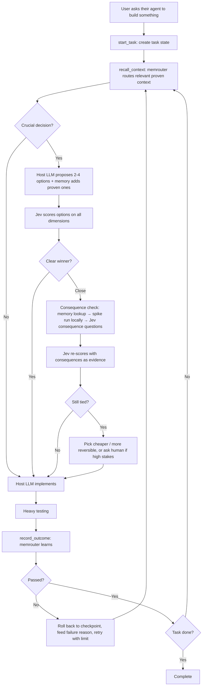

# Long-Horizon Agent Platform — Master Project Document

> **This is the source of truth.** It consolidates every decision made so far.
> - `MEMROUTER.md` holds the detailed memory spec and remains valid; where it conflicts with this file, **this file wins**.
>
> Status: design complete for the core; several component specs still to write (see §15).

---

## 1. Problem

Agents on long, multi-step tasks fail in predictable ways:
- **Context bloat** → high token cost, worse reasoning.
- **Goal drift** → lose goal, constraints, earlier decisions.
- **Wrong early choices** → a crucial decision (framework, database, architecture) made in one shot, discovered wrong many steps later.
- **Compounding errors** with no clean recovery.
- **No learning** → every task starts from zero; the same mistakes repeat.
- **Low visibility** into why the agent did what it did.

Simple tools already solve narrow checks (e.g. `tsc`, ESLint). The platform exists only for problems simple tools can't solve: choosing well between valid options, staying on track, recovering cleanly, controlling cost, and learning over time.

## 2. What makes us different

Frontier coding agents (Claude Code, Codex, etc.) already have checkpoints, context compaction, project memory files and sandboxed tests. Shared cross-tool memory also exists (e.g. Iranti, ai-memory, mem0, Zep). **We don't compete on those.**

Our edge:
1. **Decision layer** — crucial choices are scored by a fast System One model (Jev) across cost, latency, tokens, compatibility, architecture and more, before committing.
2. **Consequence checking on close calls** — simulate before choosing, then re-score with evidence.
3. **Outcome-learning memory (memrouter)** — remembers *what worked* under which conditions, not just what happened. Gets better with every task.

Pitch: *"Other tools give agents a better notebook. We give them experience."* / *"Memory that learns like a brain, engineered like a database."*

## 3. Product model

- Users **install our MCP server** and connect it to their existing agent: Claude Code, Codex, Cursor, others.
- Access requires a **platform API key**.
- Calls consume **credits**, which pay for: Jev scoring, simulations orchestration, memrouter storage/routing, context building.
- **The user's own LLM session does the generation and implementation** (their CLI/UI and subscription). We never run the working LLM.
- Economics: expensive LLM tokens are paid by the user's existing subscription; our costs are cheap components → good margins, low price.
- Free starter tier for adoption. Show **savings per session** (tokens saved, decisions made, failures avoided) so credits feel worth it.

Division of labour:
- **Host LLM:** proposes options, implements, runs tests and spikes locally.
- **Our platform:** decides, remembers, learns, routes context.

## 4. End-to-end flow

## 5. Decision layer (Jev)

- **Jev** = System One model by TypeSafe AI. Takes state + typed questions, returns typed answers with confidence. Non-generative, fast, cheap. Early access (launched Sept 2026) → verify on our own tasks; keep swappable.
- **Only crucial decisions** go through the full flow: hard to reverse, affects many later steps, or has real cost (framework, DB, architecture, key libraries). Routine steps skip it.
- **Scoring dimensions:** budget/cost, latency, token usage, compatibility, architecture fit, accuracy, and others as needed.
- **One question per dimension per option**, run in parallel; combine in our code with configurable weights.
- **Compute what's measurable in code** (token and cost estimates); use Jev for judgements (compatibility, architecture fit, accuracy).
- **Two passes:** Jev scores options → on close calls, consequences are gathered → Jev re-scores with them as evidence. The simulation informs; Jev decides.
- **Second tie:** don't loop. Pick the cheaper or more reversible option, or ask a human if stakes are high.
- Memory feeds Jev evidence (track records, fear warnings) before scoring.
- Keep a small-LLM scorer as comparison to prove Jev's value.

## 6. Consequence checking ("world model")

Generative world model is too expensive and we don't want generated text — only consequences. Chain, cheapest first:

1. **Static checks** (type checks, lint, dry runs, affected tests) — real consequences, no tokens.
2. **Memory lookup** — similar past decisions and their outcomes; reuse past spike results.
3. **Spike** — tiny proof of concept per close option, **run on the user's machine by the host LLM**; our MCP specifies what to build and measure. Returns **structured results** (numbers, pass/fail), not prose.
4. **Jev consequence questions** — "will this break existing tests?", "will it exceed token budget?".
5. **Try and roll back** — sometimes cheaper than simulating.

**Learned world model (later):** DreamerV3-style latent world model trained on our logged state → option → outcome data. Predicts success, tokens, cost in latent space in milliseconds. Kept in the architecture from day one behind the same interface; swapped in only when it beats the stand-ins. **Log data in a trainable format from day one.**

Open experiment: on a sample of ties, run all options for real, then compare Jev vs simulation accuracy and cost. Also a strong publishable result.

## 7. Memrouter

Full spec in `MEMROUTER.md`. Summary of decisions:
- **Memory types:** episodes (decision records) → consolidated into lessons and strategies by a periodic **"sleep" job**.
- **Episodes are never deleted.** The sleep job archives low-value episodes to cold storage: excluded from retrieval, kept as world-model training data. Pruning applies only to links and the retrieval index.
- **Link learning:** Hebbian, driven by **surprise** = signed prediction error (`outcome_score − predicted_score`, range −1 to 1; formula in `MEMROUTER.md` §5), weighted human > auto > implicit.
- **Routing:** similarity + condition match → **spreading activation** through links → Jev as **attention filter** within a token budget.
- **Decay:** usage-based with **spaced repetition**; pruning of weak links; nothing permanent.
- **Conditions + reconsolidation:** outcomes carry conditions (stack, scale…); contradictions refine conditions instead of just weakening.
- **Fear memories:** one severe failure creates a strong warning instantly, still revisable.
- **Scope:** task → project → team, fully isolated per team. Later, opt-in **colony layer** sharing only anonymous trail strengths.
- **Shared context layer** for all agents, subagents and sessions, with provenance and conflict handling.
- **Tracks predictor trust** (was Jev / simulation / memory right?).
- **Not a single point of failure:** agents keep working on task state if memrouter is down.
- Storage: Postgres + pgvector to start.

## 8. Task state and checkpoints

- **Task state** (created by `start_task`, stored by us): goal (verbatim), constraints, plan, progress, key decisions and reasons, open issues. Compact, always included in routed context.
- **Checkpoints** use the host's own mechanisms (git commits, Claude Code checkpoints); we record checkpoint references with each decision.
- **Rollback:** restore, feed the failure reason back into the decision step, enforce retry limit, escalate to human after the limit.

## 9. Outcome and testing layer

- **Heavy testing after every implementation** is the ground truth.
- Signals, cheapest first: **automatic** (tests, builds, type/lint checks) → **implicit** (user accepts / edits / reverts) → **human approval** only when others are missing, confidence is low, or stakes are high (spending money, sending messages, deleting data).
- Outcomes are **self-reported by the host** → risk of skipping or misreporting. Use **hooks** to capture real test output instead of trusting the model's summary.
- Record: option chosen, what Jev and simulation predicted, what tests found.

## 10. User interface

- **No full dashboard in v1.** The "better view" lives inside the user's agent conversation.
- **Human approvals** via MCP's ability to request user input mid-task.
- **Inspection MCP tools:** explain a decision, show relevant memories, view and delete memories.
- **Minimal web page:** account, API keys, credits, usage, savings.
- **Internal debugging/benchmarks:** existing tracing tool (e.g. Langfuse).
- **Full dashboard later** when teams running many agents ask for a shared view (signal for a paid team tier).

## 11. LLM integration (MCP)

**Core tools:**
- `start_task` — create task state.
- `recall_context` — return routed memory slice + task state.
- `evaluate_options` — take candidates, return decision or a spike request.
- `submit_consequences` — spike / check results → Jev re-score.
- `record_outcome` — test results and signals → memory learning.

**Inspection tools:** `explain_decision`, `show_memories`, `delete_memory`, `clear_fear`.

**Getting called reliably (biggest product risk):** MCP is passive; the host decides when to call. Ship with:
- Clear, directive tool descriptions.
- Ready-made instruction snippets for `CLAUDE.md` / `AGENTS.md`.
- **Hooks** (e.g. session start, before/after tool use, after tests) so key steps like recording outcomes happen automatically.

**Later:** Python SDK and LangGraph adapter for teams building their own agents.

## 12. Privacy and data

- Store **decision summaries, conditions and outcomes — not raw code**.
- Spikes and tests run **locally**; we never need the user's repository.
- Per-team isolation; colony layer is opt-in, anonymous, generic lessons only.
- Clear public data policy; essential for selling to companies.

## 13. Build order

Benchmark after every phase; cut anything that doesn't move success rate or cost.

1. **Benchmark harness + baseline** — plain host agent on a coding benchmark subset (e.g. ~50 SWE-bench Lite tasks); record success, tokens, cost, steps, time.
2. **MCP skeleton + host integration + basic memory** — `start_task`, `recall_context`, `record_outcome`, hooks, instruction snippets. Prove the host calls us reliably. *Prototype this early.* Includes memrouter build step 1 (`MEMROUTER.md` §16): episodes, write path, basic similarity recall — because `recall_context` and `record_outcome` need it.
3. **Task state + checkpoint references + rollback rules.**
4. **Decision layer** — crucial-decision detection, Jev scoring, weights, thresholds.
5. **Consequence checking** — static checks, memory lookup, local spikes, Jev re-score.
6. **Memrouter learning** — `MEMROUTER.md` build steps 2–7: surprise-based links, spreading activation, Jev attention filter, decay, consolidation (sleep job), conditions and reconsolidation, fear memories, predictor trust and simulation reuse. Show improvement over repeated runs vs a standard memory layer.
7. **Inspection tools, approvals, web page for keys/credits.**
8. **Launch** — publish repo, benchmarks and write-up.
9. **Later** — learned world model, SDK/LangGraph adapter, team dashboard, colony layer.

Wedge: **coding agents first** (verifiable outcomes, real token pain). Expand to other task types once the loop works.

## 14. Success metrics

- Task success rate vs baseline.
- Tokens and cost per completed task.
- Improvement across repeated runs (the headline chart).
- Share of close calls settled from memory instead of spikes.
- Jev vs simulation prediction accuracy.
- Rate of reliable MCP invocation by the host.
- Human approval rate (should fall over time).

## 15. Still open

**Specs to write:**
- Decision service: exact Jev questions, weights, thresholds, crucial-decision detection.
- Consequence checking: spike format, measurements, structured result schema.
- Outcome layer: what "heavy testing" includes; scoring of results.
- Benchmark harness: tasks, baseline agent, measurements.
- MCP tool schemas and hook set.
- Data logging format for the future world model.

**To resolve:**
- Test Jev access for real (API, pricing, limits).
- Reconcile with the existing memrouter project (results not yet shared).
- Name check: another GitHub project is already called MemRouter.
- Positioning, credit pricing, free tier limits.
- Build-in-public plan.

## 16. Key risks

- **Host doesn't call the MCP reliably** → mitigated by hooks and instruction snippets; prototype first.
- **Noisy outcome signals** → memory learns wrong lessons; use hooks for real test output, weight human signals higher.
- **Jev dependency** (early access, single vendor) → keep scorer swappable.
- **Per-decision overhead** → full flow only on crucial decisions.
- **Platform competition** → edge is decision layer + outcome-learning memory, not checkpoints or context sharing.
- **Trust/privacy** → no raw code stored, local execution, per-team isolation.

## 17. Tech stack

- **Language:** Python 3.12.
- **MCP server:** official MCP Python SDK. **Streamable HTTP** transport for the hosted server (authenticated by platform API key); **stdio** for local development.
- **Account API:** FastAPI for API keys, credits and usage endpoints.
- **Storage:** Postgres + pgvector.
- **Embeddings:** behind an interface; default is a small open-source model run locally.
- **Tests:** pytest.
- **Runtime:** Docker for local and cloud runs; everything containerised. Hosting provider decided at launch.
